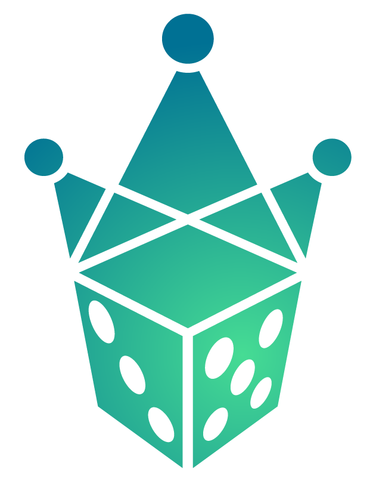
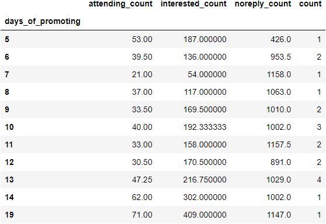
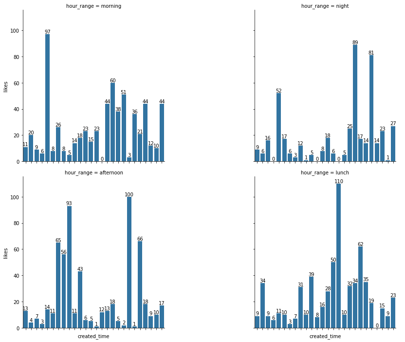
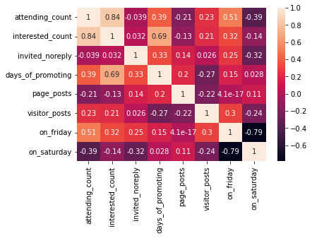
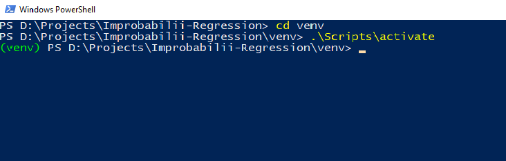
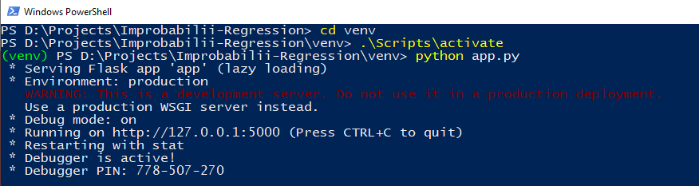
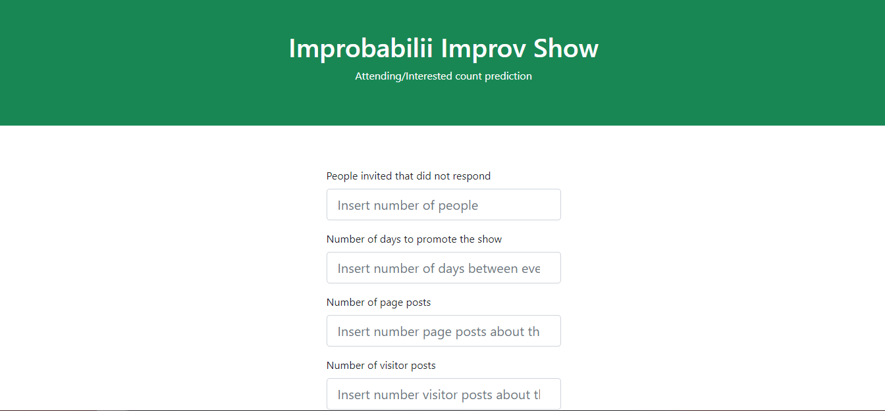

<h1 style="text-align: center"> Improbabilii Facebook Stats </h1>

<div align="center">
  
</div>
<br>
<br>

## Business Case

Is there any correlation between page posts and number of people interested
in an event? What about what and how many times we post? These are all questions
I wanted to answer through this project.

First of all, a little bit of background: Improbabilii is an improv group
created in Cluj-Napoca in 2018. I am a member of this group and we have been
doing improvisation events since (fewer however since the pandemic outbreak).

The aim of this project was to create an ML model which could predict how many
people will click on interested and going for one of our events. This was my
first attempt to work with Facebook data and it was an interesting experience.
I hoped to find something relevant so that I could present it to my colleagues
as well.

This project is made up of 3 main parts:
- acquiring the data
- cleaning the data and extracting useful information for a presentation
- modeling

However, here I want to give a more granular look into what this project meant.

## Table of Contents
<details open>
<summary>Show/Hide</summary>

1. [File/Folder descriptions](#1.-file//folder-descriptions)
2. [Data retrieval](#2.-data-retrieval)
3. [Exploratory data analysis](#3.-exploratory-data-analysis)
4. [Visuals and presentation](#4.-visuals-and-presentation)
5. [Feature engineering](#5.-feature-engineering)
6. [Modeling](#6.-modeling)
7. [How to run with Flask](#7.-how-to-run-with-flask)
8. [Conclusion](#8.-conclusion)
    * 8.1. [What did I learn?](#8.1.-what-did-i-learn)
    * 8.2. [Improvements](#8.2.-future-improvements)

</details>


## 1. File/Folder descriptions

<details open>
<summary>Show/Hide</summary>

* **data**: this is a folder containing all of the Data
    * **eventdata**: folder containing 2 json files per event: one with page posts
    and one with visitor posts; all the posts are made between event creation
    date and event start date
    * **curated_eventdata**: folder containing the same files as above, but these
    files were manually cleaned so they contain only posts **related** to the
    event
    * **event_entries.json**: raw data from Facebook about events, in json format
    * **feed_entries.json**: raw data from Facebook about Improbabilii page feed,
    in json format
    * **improv_events.xlsx**: excel document containing all training data to manually
    check model accuracy, if needed
    * **tagged_entries.json**: raw data from Facebook about posts in which
    Improbabilii page was tagged, in json format
    * **visitor_posts_entries.json**: raw data from Facebook about people/pages that
    posted about Improbabilii, in json format
* **models**: this is a folder where I have saved everything I needed to use the
found model at a later stage
    * **best_model.p**: the best regression model found during modeling, saved as
    a pickle file
    * **scaler.p**: scaler used for getting the data at around same level before
    modeling, and needed for new test samples, saved as a pickle file
* **Presentation**:
    * **Improbabilii in timp.pptx**: powerpoint presentation I used to show
    my colleagues (it's in Romanian)
    * all the .png, .json and .txt files were extracted from the Facebook data
    and used in the presentation to present my findings
* **venv**: folder in which I installed a virtual Python environment so I can run
my Flask server; it has all default files from virtual environment installation;
I will list here the added/modified files for this project  
    * **app.py**: the actual flask server which will receive requests and process
    them; here we use the model and scaler
    * **templates**: folder which contains index.html, the main and only page of the
    app; this contains forms which collects the data for predictions
* **1. Facebook Data Retrieval.ipynb**: the jupyter notebook containing logic for
accessing the Facebook API and retrieving Facebook data
* **2. Improbabilii EDA and Modeling.ipynb**: jupyter notebook in which I explored
the raw data, transformed it for modeling and created useful graphs for the
presentation; the last step was modeling and saving the best found model
* **3. Best Show Parameters.ipynb**: jupyter notebook in which I used the found
model to test different parameters in order to find the best combination for a
future show
* **Feedback.txt**: because this was my first "official" project and presentation,
I felt it necessary to collect some feedback
* **requirements.txt**: all the libraries used in the jupyter notebooks

</details>


## 2. Data retrieval

<details open>
<summary>Show/Hide</summary>

The first obstacle was to get the data from Facebook. It took some time and
research to find out that the most reasonable way was to learn how to use their
graph API and use it. So I did exactly that. Some setps were intuitive, some
were not. However, I managed to find 4 endpoints that at the time seemed the most
interesting: event, feed, tagged and visitor_posts.

To get the data I have used Python's good ol' reliable requests library and
saved my raw data into json files, later to be cleaned and used for modeling.
However, Facebook also has it's own client that lets you quickly test your
requests and also suggests useful endpoints/parameters.

<div style="text-align:center">
    
</div>
<br>
<br>

I have to say that in order to access these endpoints for a page, you need to
be an admin for that page and create an app from your Facebook developer account
and give it access to these endpoints. It was a little bit complicated at first,
but there were many tutorials on the web to help with that.

All the data was saved in its separate json file in the data folder.

</details>


## 3. Exploratory data analysis

<details open>
<summary>Show/Hide</summary>

This was the part of the project where I could use my imagination and curiosity
to find interesting insights about our improv group's social media presence.
I wanted to see a little bit of history (as much as we can get from a Facebook
page), but also how we interacted with our followers online.

I have come up with several ideas I wanted to explore, among which were the
following:

* Number of improv shows
* Average interested/going per event
* Post likes/shares per category of post
* Going/interested count per season
* Top 5 posts for shares/likes

The whole list that I came up with is listed in the notebook.

This was also the stage in which I had to find out how I can combine my data
in order to achieve the desired statistics.

</details>


## 4. Visuals and presentation

<details open>
<summary>Show/Hide</summary>

There is no good project without a succinct presentation. And this was what I
aimed for in this part. I wanted to create all the visuals I could think of
for a good presentation. Again, this required a brainstorming process.

<h5 align="center">Average engagement per days of promoting</h5>
  <p align="center">
  
  </p>
<br>
<br>

<h5 align="center">Page posts likes per hour range</h5>
  <p align="center">
  
  </p>
<br>
<br>

Coming up with what graphs I can draw from my data and how to arrange it in such
a way that I can draw them was particularly interesting, as it led the way
towards the next step: what kind of features can I use to make a prediction?

</details>


## 5. Feature engineering

<details open>
<summary>Show/Hide</summary>

What I realized from the beginning, but was most evident here was that I do not
have a big amount of data to work with. This meant that I could not use many
features to train models. Therefore, I needed to pick my fighters carefully and
think them through.

In the EDA phase I could see what my data sets are comprised of and could begin
to define what can be useful for predictions. In the end I came up with 4
important features:

- **days_of_promoting** = days passed from event online creation until event
in person start
- **number_of_page_posts** = number of posts from the page relating the given event
during the period between online creation and in person start
- **number_of_visitor_posts** = number of posts from any entity but the page
relating the given event during the period between online creation and in
person start
- **number_of_unresponding_invited** = number of people that were invited to the
event, but did not respond

What I also observed during EDA was that we had a lot of shows during Fridays
or Saturdays and I wanted to include this data somehow. Therefore, I had created
two sets of data for modeling:

- one with the features presented above
- second with these features plus 2 more binary features: on_friday and
on_saturday which would take value 1 if true

I have validated my theory by also creating a correlation matrix for these
features and the target features.

<h5 align="center">Correlation matrix of main features</h5>
  <p align="center">
  
  </p>
<br>
<br>

</details>


## 6. Modeling

<details open>
<summary>Show/Hide</summary>

I have detailed this process in the notebook, so I will just summarize the steps
I took here:

1. Create a list of models to try initially.
2. Using MultiOutputRegressor and RegressorChain (because I want to predict for
both interested and going) get top10 models for each.
3. For these top models see what kind of predictor classes they belong to and
bring all the related models in and repeat the process in step 2.
4. Out of these (possibly less than) 20 models, select the top 5.
5. Using GridSearch, fine tune these 5 models.
6. Select the best performing fine tuned model.

I have used negative mean squared error as my evaluation score.
Most of the models were quick to train, but some took a lot of time and I had to
rethink the way I test parameters so as to not need to wait a lot of time.
Waiting a lot of time would be ok for a big dataset, but mind you this was a
20-30 entries dataset and waiting more than a few minutes per model does not
seem reasonable.

```Python
def get_all_best_models_from_grid_search(all_models, all_parameters_grids, X_train, y_train):
    best_models_dict = {'model': [], 'score': [], 'parameters': []}
    for i in range(len(all_models)):
        start_time = time.time()
        best_model = get_best_model_from_gridsearch(all_models[i], all_parameters_grids[i], X_train, y_train)
        best_models_dict['model'].append(best_model[0])
        best_models_dict['score'].append(np.sqrt(-best_model[1]))
        best_models_dict['parameters'].append(best_model[2])
        end_time = time.time()
        print("Model took {} seconds\n".format(end_time - start_time))
    return pd.DataFrame(best_models_dict)
```

All this search ended up finding that a GaussianProcessRegressor on the data set
containing just the 4 main features presented at the
[feature engineering step](5.-feature-engineering). I shall use this model to
make our predictions.

</details>


## 7. How to run with Flask

<details open>
<summary>Show/Hide</summary>

The app is hosted on heroku at the following [link](https.herokuapp.com)
If you want to run the server locally, the following steps are necessary:

1. Download this project, or at least the venv folder and the models folder.
2. Open a command prompt in the venv folder and run the command
.\Scripts\activate

<br>
<p align="center">
    
</p>

<br>

3. In the same command prompt run the command python app.py

<br>
<p align="center">
    
</p>
<br>

4. Finally you can access the page by going at the provided address
http://127.0.0.1:5000 .
There you should see a page that looks like this:

<br>
<p align="center">
    
</p>
<br>

</details>


## 8. Conclusion

<details open>
<summary>Show/Hide</summary>

This was a great learning process and I am glad I went through it.
It was something I needed to do to gain confidence in my ability as a data
scientist. Working on something you like is always inspiring.

What I liekd best about this project was that I could give insights to my
friends about our online activity and also have an "end product" to show them.

### 8.1 What did I learn?

<details open>
<summary>Show/Hide</summary>

First and foremost I have learned to work with Facebook Graph API. This was a
very eye opening process in itself. I liked the fact that I just wanted to build
a project, had no idea how, but figured it out step by step.

What I also enjoyed was the "detective" work that I set for myself. Because this
was one of my first projects I was constantly researching models and best
practices. I have learnt about spot checking, about multiple output modeling and
had an overview of all available models in scikit-learn.

Last but not least, I understood why so many articles/comments state that "you
do not have a bad model, you just don't have enough data" or something along
the lines. I hope that, perhaps over a few years, I will have enough data about
our online presence so that I could build an accurate enough model.
But until then:
"This will do, model. This will do"

</details>

### 8.2 Improvements

<details open>
<summary>Show/Hide</summary>

There are some ideas which I believe could improve this project and will try to
implement some whenever I come back to it:
- a more meaningful way to choose the best model; sure, plain "what's best"
evaluation works, but perhaps have a baseline to compare with, something like
the mean of all the entries would be a good addition
- create a script to retrieve data from Facebook API
- if (although highly unlikely) the number of page posts/events shall grow
exponentially, find a way to import only data from a certain checkpoint
(append data to database instead of writing it in full again)
- find a way to automate the manual search through page_posts and visitor_posts
for each event when checking if the post correlates to the event; perhaps here I
could use regex

</details>

</details>
